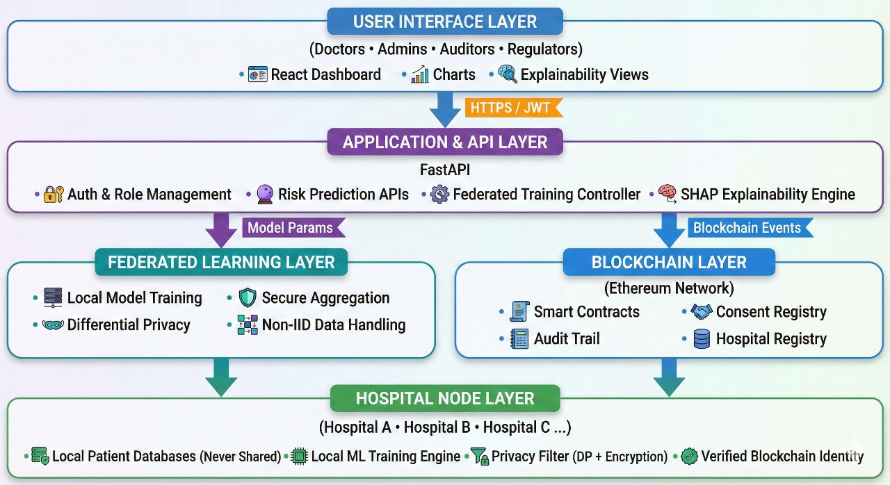

# 🏥 ChainFL-Care ⛓️  
### Privacy-Preserving Federated Learning for Healthcare

**ChainFL-Care** is a next-generation, privacy-first healthcare AI platform that enables hospitals to collaboratively train powerful disease-risk prediction models **without sharing sensitive patient data**. By combining **Federated Learning, Explainable AI, Differential Privacy, and Blockchain-based consent management**, ChainFL-Care establishes trust, compliance, and scalability for real-world healthcare deployment.

---

## 🎯 Problem Statement

Healthcare institutions are restricted by **HIPAA, GDPR, and national data-protection laws**, preventing them from sharing patient data. As a result:

- AI models are trained on **small, siloed datasets**
- Models fail to generalize across diverse populations
- Cross-hospital collaboration is nearly impossible
- Compliance auditing is manual and error-prone

This severely limits the potential of AI in critical disease prediction and preventive care.

---

## 💡 Our Solution

**ChainFL-Care** introduces a **Blockchain-powered Federated Learning ecosystem** where:

- Hospitals collaboratively train AI models  
- No raw patient data ever leaves hospital premises  
- Only encrypted model updates are shared  
- Patient consent is immutably recorded on blockchain  
- Model predictions are explainable and auditable  

➡️ **Data stays local. Intelligence scales globally.**

---

## 🚀 Key Features

### 1️⃣ AI-Powered Disease Risk Prediction
- Multi-disease risk assessment (Cardiac, Liver, Kidney, Hypertension)
- Requires only **4 basic parameters**
- Real-time predictions with confidence scores
- **SHAP-based explainable AI**

### 2️⃣ Federated Learning Engine
- Secure cross-hospital model training
- No raw data sharing
- Handles non-IID hospital data
- Multi-round automated training
- Live performance metrics

### 3️⃣ Blockchain-Based Consent Management
- Immutable patient consent records
- Smart-contract enforced permissions
- Complete audit trail of data access

### 4️⃣ Hospital Node Registry
- Decentralized hospital verification
- Blockchain-based node onboarding
- Transparent collaboration framework

### 5️⃣ Professional Analytics Dashboard
- Real-time monitoring
- Risk trends & insights
- Compliance and audit reports

---



---

## 🛠️ Tech Stack

**Frontend**
- React.js
- Recharts
- Lucide Icons

**Backend**
- FastAPI
- Scikit-learn
- Web3.py
- Pydantic

**Blockchain**
- Ethereum
- Solidity
- Ganache

**ML / AI**
- RandomForest Classifier
- SHAP
- Differential Privacy

---

## 🔒 Privacy & Security

- No raw patient data sharing
- Encrypted model updates
- Blockchain audit trail
- Granular patient consent
- HIPAA & GDPR-aligned design

---

## 📊 ML Model Details

- Algorithm: RandomForest Classifier
- Accuracy: ~85–95% (improves with FL rounds)
- Explainability: SHAP values
- Disease Coverage: Multi-disease

---

## 💰 Business & Subscription Model

### 🟢 Starter Plan — Clinics
**₹2,999 / month**
- Risk prediction
- Explainable reports
- Basic dashboard

### 🔵 Professional Plan — Hospitals
**₹14,999 / month**
- Federated learning participation
- Advanced analytics
- Compliance logs

### 🟣 Enterprise Plan — Hospital Chains
**Custom Pricing**
- Blockchain consent management
- Dedicated nodes
- Regulatory audit reports

### 🟠 Government / Insurance Licensing
- National deployment
- Population health analytics
- Annual licensing

---

## 🌍 Future Scope

- National Federated Health Grid
- Agentic AI security layer
- Patient consent wallet
- Expansion to finance, defense, and smart cities

---

## 🆚 Competitive Advantage

- Zero-trust privacy architecture
- Explainable AI by design
- Blockchain-backed compliance
- Production-ready and scalable

---

## 🎮 Installation & Setup

### Prerequisites
- Node.js 16+
- Python 3.9+
- Ganache

### Clone Repository
```bash
git clone https://github.com/Suprithh7/ChainFL.git
cd ChainFL
```

### Backend
```bash
cd backend
pip install -r requirements.txt
uvicorn main:app --reload
```

### Frontend
```bash
cd frontend
npm install
npm run dev
```

### Blockchain
```bash
ganache --port 8545
```

---

## 📝 License
MIT License

---

## 🏆 Final Note

**ChainFL-Care is not just a project — it is a deployable, regulation-ready infrastructure for the future of healthcare AI.**
