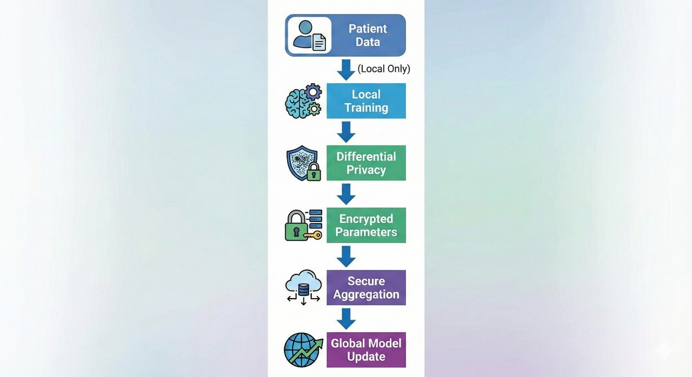

# ChainFL-Care  
## Privacy-Preserving Federated Learning Platform for Healthcare

ChainFL-Care is a production-oriented, privacy-first healthcare AI platform that enables hospitals and medical institutions to collaboratively train high-performance disease risk prediction models without sharing raw patient data.

The platform integrates Federated Learning, Explainable AI, Differential Privacy, and Blockchain-based consent management to deliver a secure, compliant, and scalable infrastructure suitable for real-world healthcare deployment.

---

## Problem Statement

Healthcare organizations operate under strict regulatory frameworks such as HIPAA, GDPR, and national data-protection laws, which prohibit the centralized sharing of sensitive patient data. As a consequence:

- AI models are trained on isolated, small-scale datasets  
- Models fail to generalize across diverse populations  
- Cross-institutional collaboration is severely limited  
- Compliance auditing remains manual and error-prone  

These constraints significantly reduce the effectiveness of AI-driven disease prediction and preventive healthcare systems.

---

## Solution Overview

ChainFL-Care introduces a Blockchain-powered Federated Learning ecosystem where:

- Hospitals collaboratively train shared AI models  
- Patient data never leaves hospital premises  
- Only encrypted model updates are exchanged  
- Patient consent is immutably recorded on blockchain  
- Model predictions are transparent, explainable, and auditable  

Data remains local. Intelligence scales globally.

---

## Key Capabilities

### AI-Based Disease Risk Prediction
- Multi-disease risk assessment (Cardiac, Liver, Kidney, Hypertension)
- Minimal input requirement (four core clinical parameters)
- Real-time inference with confidence scoring
- SHAP-based explainability for clinical transparency

### Federated Learning Engine
- Secure cross-hospital collaborative training
- No raw data sharing
- Robust handling of non-IID institutional data
- Multi-round automated aggregation
- Continuous performance monitoring

### Blockchain-Based Consent Management
- Immutable patient consent records
- Smart contract–enforced access control
- End-to-end auditability for regulatory compliance

### Hospital Node Registry
- Decentralized hospital onboarding and verification
- Blockchain-backed node identity management
- Protection against unauthorized or malicious participants

### Analytics and Monitoring Dashboard
- Real-time training and inference metrics
- Population-level risk trends
- Compliance and audit reporting

---

## System Architecture


---

## Technology Stack

### Frontend
- React.js  
- Recharts  
- Lucide Icons  

### Backend
- FastAPI  
- Scikit-learn  
- Pydantic  
- Web3.py  

### Blockchain
- Ethereum  
- Solidity  
- Ganache  

### Machine Learning
- Random Forest Classifier  
- 1D Convolutional Neural Network (ECG analysis)  
- SHAP for explainability  
- Differential Privacy mechanisms  

---

## Privacy and Security Design

- No raw patient data sharing  
- Encrypted model updates during federated training  
- Blockchain-based audit trails  
- Granular, patient-controlled consent  
- Architecture aligned with HIPAA and GDPR principles  



---

## Machine Learning Details

- Models: Random Forest, 1D CNN (ECG signals)  
- Accuracy Range: Approximately 85–95%, improving with federated rounds  
- Explainability: SHAP value attribution  
- Coverage: Multi-disease risk prediction  

---

## Business and Deployment Model

### Starter Plan — Clinics  
₹2,999 per month
- Disease risk prediction  
- Explainable clinical reports  
- Basic analytics dashboard  

### Professional Plan — Hospitals  
₹14,999 per month
- Participation in federated learning  
- Advanced analytics and monitoring  
- Compliance and audit logs  

### Enterprise Plan — Hospital Networks  
Custom pricing
- Dedicated blockchain nodes  
- Full consent lifecycle management  
- Regulatory-grade audit reporting  

### Government and Insurance Licensing
- National-scale deployments  
- Population health analytics  
- Annual enterprise licensing  

---

## Future Roadmap

- National Federated Health Data Grid  
- Agentic AI–based security monitoring  
- Patient-controlled digital consent wallets  
- Expansion into finance, defense, and smart-city domains  

---

## Competitive Differentiation

- Zero-trust privacy architecture  
- Explainable AI by default  
- Blockchain-backed regulatory compliance  
- Production-ready, horizontally scalable design  

---

## Installation and Setup

### Prerequisites
- Node.js 16 or higher  
- Python 3.9 or higher  
- Ganache  

### Clone Repository
```bash
git clone https://github.com/Suprithh7/ChainFL.git
cd ChainFL
